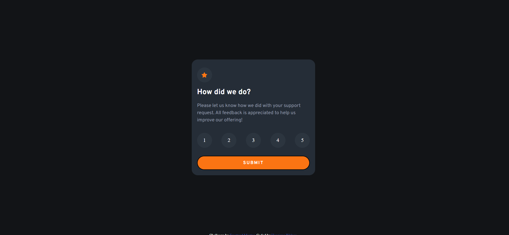
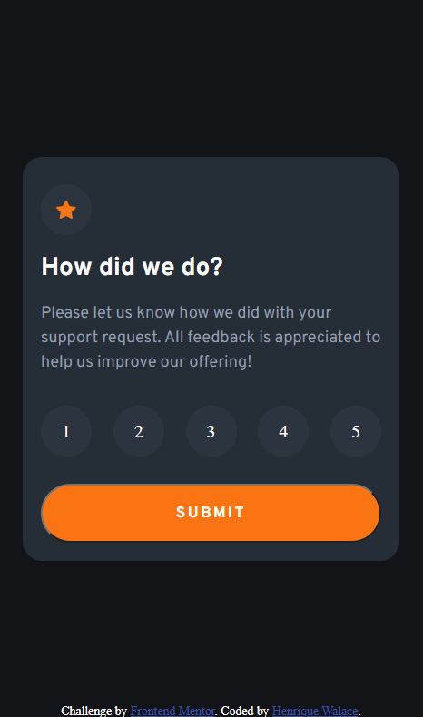

# Frontend Mentor - Interactive rating component solution

This is a solution to the [Interactive rating component challenge on Frontend Mentor](https://www.frontendmentor.io/challenges/interactive-rating-component-koxpeBUmI). Frontend Mentor challenges help you improve your coding skills by building realistic projects. 

## Table of contents

- [Overview](#overview)
  - [The challenge](#the-challenge)
  - [Screenshot](#screenshot)
  - [Links](#links)
- [My process](#my-process)
  - [Built with](#built-with)
  - [What I learned](#what-i-learned)
- [Author](#author)

## Overview

I am starting be confortable using CSS, but I still have a little difficult naming the classes, so in this project I started to use BEM(a nomenclature pattern) to see if this helps me. Overrall I think I'm improving and my challenges are starting to get more close to the desing proposed.

### The challenge

Users should be able to:

- View the optimal layout for the app depending on their device's screen size
- See hover states for all interactive elements on the page
- Select and submit a number rating
- See the "Thank you" card state after submitting a rating

### Screenshot

### Links

- Solution URL: [Repository](https://github.com/Walace2022/Interactive-Rate-Component)
- Live Site URL: [Site](https://walace2022.github.io/Interactive-Rate-Component/)

## My process

### Built with

- Semantic HTML5 markup
- Flexbox
- Mobile-first workflow

### What I learned

In this project I practice my JavaScript a litle, but what a have learned more was the BEM pattern on how to name CSS classes.

## Author

- Github - [Walace2022](https://github.com/Walace2022)
- Frontend Mentor - [@Walace2022](https://www.frontendmentor.io/profile/Walace2022)

